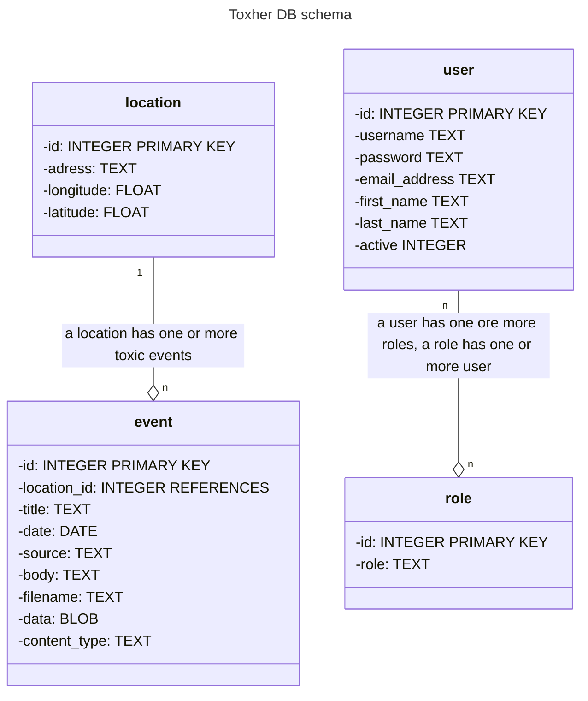

# Toxher

## Installation

### Install Catalyst

`$ cpanm install Catalyst::Runtime`
`$ cpanm install Catalyst::Devel`
`$ cpanm install Catalyst::View::TT`

### Install Database

Use the following command to build a toxher.db SQLite database:

`$ sqlite3 toxher.db < db/schema.sql`

Add the authentication schema to the toxher.db database:

`$ sqlite3 toxher.db < db/auth.sql`

Before eventually using this command again delete an existing toxher.db. Then
run 

`$ ./script/toxher_create.pl model DB DBIC::Schema ToxHer::Schema create=static naming=current use_namespaces=1 dbi:SQLite:toxher.db on_connect_do="PRAGMA foreign_keys = ON"`

for generating/updating result classes. The toxher.db database file must be in
the app's topmost directory. To test the application, then run

`$ script/toxher_server.pl -r`

## Database

## TODOs

auth/validate
- password eq password2
- ch class users to class user
